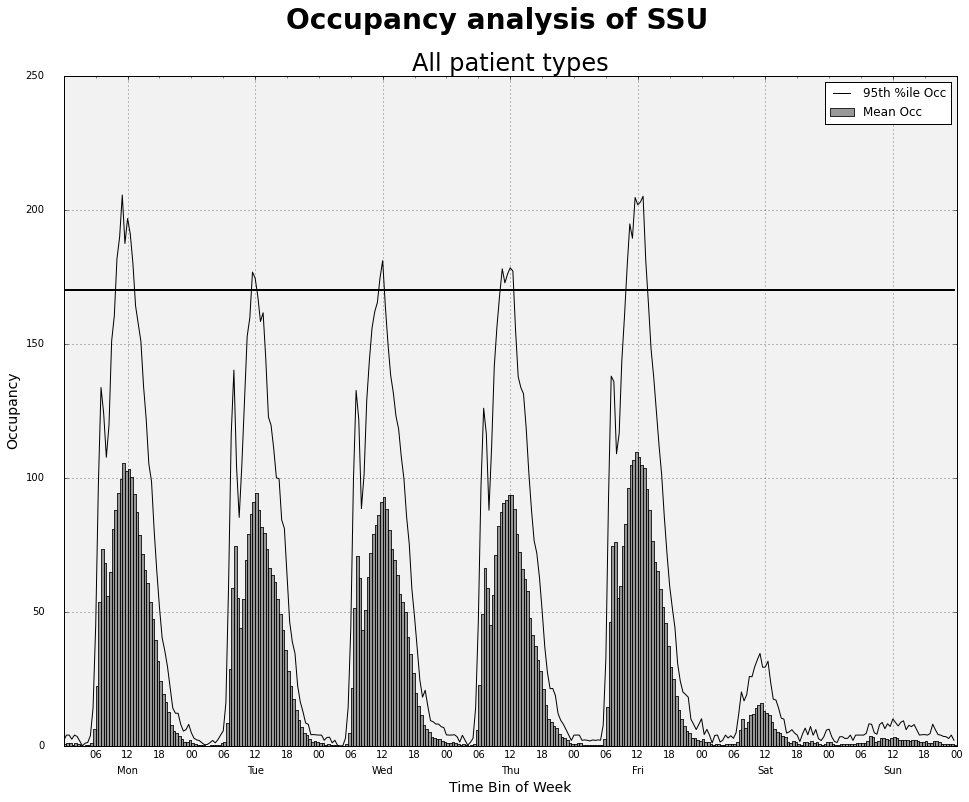

.. _overview:

.. currentmodule:: hillmaker

******************
What is hillmaker?
******************

Hillmaker is a Python package that facilitates statistical occupancy analysis of
systems involving the arrival and departure of discrete entities. It is
particularly useful when time of day and day of week effects are of interest. It
gets its name from the hill-like nature of occupancy statistics plotted by time
of day and day of week (see plot below). The original version of Hillmaker was
developed many years ago (using MS Access and VBA) in response to capacity
planning problems arising in health care delivery systems such as hospitals and
outpatient clinics. Typical examples include emergency departments,
post-anesthesia care units, inpatient nursing units, and clinics. However,
hillmaker can be used in any domain in which entities "arrive", occupy capacity
for some amount of time, and then "depart". For example, work in process within
a manufacturing system can be analyzed using the entry and exit times of each
part flowing into some process or stage of interest. The only data requirement
is the arrival and departure times for each entity. Optionally, each entity
can be labelled or classified as belonging to some category or class. If done,
in addition to overall, occupancy statistics by category are also computed.

----------------------------------
Example - Hospital short stay unit
----------------------------------

Hospital short stay units (SSU) provide a place to care for patients that don't
need to admitted but might stay for up to a day. Patients often use a SSU to
undergo or recover from a therapy or procedure. Consider a simplified SSU caring
for fived different patient types: ART (arterialgram), CAT (post cardiac-cath),
MYE (myelogram), IVT (IV therapy), and OTH (other).

Here's a snippet of a data file (CSV) containing records of patients visiting
the SSU (the entire file contains just under 60,000 records corresponding
to nine months of SSU activity):

  PatID,InRoomTS,OutRoomTS,PatType
  1,1/1/1996 7:44,1/1/1996 8:50,IVT
  2,1/1/1996 8:28,1/1/1996 9:20,IVT
  3,1/1/1996 11:44,1/1/1996 13:30,MYE
  4,1/1/1996 11:51,1/1/1996 12:55,CAT
  5,1/1/1996 12:10,1/1/1996 13:00,IVT
  6,1/1/1996 14:16,1/1/1996 15:35,IVT
  7,1/1/1996 14:40,1/1/1996 15:25,IVT
  8,1/1/1996 17:25,1/1/1996 19:00,CAT
  9,1/2/1996 6:17,1/2/1996 8:25,MYE
  10,1/2/1996 6:35,1/2/1996 8:30,ART

The `InRoomTS` and `OutRoomTS` fields contain timestamps corresponding to when
the patient entered and exited the SSU. `PatType` is the category for each
patient. In order to help develop SSU staffing plans, we would like to compute
the average and 95'th percentile of SSU occupancy by day of week and hour of
day. In addition to overall occupancy statistics, we'd like to compute the same
statistics by patient type. And, it's not just occupancy we are interested in.
We also want to compute these statistics for arrivals and departures from the
SSU. From such summaries we can create plots to visualize the results.

The key inputs needed for running hillmaker are the name of the `pandas
<http://pandas.pydata.org/>`__ DataFrame containing the transaction records, the
datetime field corresponding to the entry time, the datetime field corresponding
to the exit time, the (optional) field corresponding to the categories, the date
range for selecting transaction records for the analysis (the *analysis
period*), and the *time bin* size (in minutes). While hillmaker has a number of
options, the  simplest use case involves importing hillmaker and pandas, reading
the data file into a DataFrame and making a single function call to
`make_hills`. The default timebin size is one hour.

::

  import pandas as pd
  import hillmaker as hm

  # Read data from CSV file into a pandas dataframe
  stops_fn = '../data/ShortStay.csv'
  stops_df = pd.read_csv(stops_fn, parse_dates=['InRoomTS','OutRoomTS'])

  # Required inputs
  scenario = 'ss_example_1'
  in_fld_name = 'InRoomTS'
  out_fld_name = 'OutRoomTS'
  cat_fld_name = 'PatType'
  start = '1/1/1996'
  end = '3/30/1996 23:45'

  # Run hillmaker
  hm.make_hills(scenario, stops_df, in_fld_name, out_fld_name,
                start, end, cat_fld_name)

hillmaker outputs a number of DataFrames containing the results of the
analysis. One of these DataFrames contains the summary statistics used to
drive the plot shown above. Here's a little bit of what that Dataframe looks
like after being exported to a CSV file.

.. image:: images/example_1_occ.png

More details on hillmaker output are described in SECTION OUTPUT.

****************
Package overview
****************

:mod:`hillmaker` consists of the following things and features

 * Takes a pandas DataFrame as the input data type
 * Functions for computing arrival, departure and occupancy summary statistics
   by time bin of day and day of week based on a pandas DataFrame containing one
   record per visit.
 * Functions for computing arrival, departure and occupancy for each datetime
   bin in the analysis period.
 * Select any time bin size (minutes) that divides evenly into a day.
 * Optionally specify one or more categories to ignore in the analysis.
 * Output statistics includes sample size, mean, min, max, standard deviation,
   coefficient of variation, standard error, skew, kurtosis, and a whole slew
   of percentiles (50, 55, 60, 65, 70, 75, 80, 85, 90, 95, 97.5, 99).
 * Output CSV files are written by default but can be supressed.
 * Optionally capture outputs as a dictionary of pandas DataFrames for further
   post-processing (e.g. plot creation).

Getting Support
---------------

To report bugs and issues or share ideas, visit the `Github Issue Tracker
<https://github.com/misken/hillmaker/issues>`__.

History and Credits
-------------------

Hillmaker got its start back in the 1980's when I was tasked with analyzing
occupancy in a hospital endoscopy unit as an management engineering intern
at William Beaumont Hospital. That first version was written in BASIC.

Next came a version written in FoxPro in the early 1990's while I was a Research
Engineer at William Beaumont Hospital. A major rewrite using the then relatively
new MS Access database package was done a few years later. This evolved into a
version that was open sourced in 2005 and is still available today at
`http://sourceforge.net/projects/hillmaker/
<http://sourceforge.net/projects/hillmaker/>`__.

Over the past ten or so years, the Access version of Hillmaker got quite a bit
of use at various healthcare institutions and consulting firms by operations
analysts, management engineers and other such analytical folk. When I left
industry to join Oakland University as a faculty member in the Department of
Decision and Information Sciences in the School of Business Administration, I
decided to write a paper about Hillmaker.

Isken, M.W. (2002) Modeling and Analysis of Occupancy Data: A Healthcare
Capacity Planning Application, *International Journal of Information Technology and Decision Making*, 1, 4 (December) 707-729.

In 2013, I did a `series of blog posts
<http://hselab.org/occupancy-analysis-with-python-pandas-part-1-create-by-date-data-frame.html>`__
that introduced a Python based approach to Hillmaker. Those proof of concept
blog posts led to the development of  the Python package hillmaker which was
publicly released in 2016.

Development Team
----------------

Right now, I (Mark Isken) am the team. If you're interested in contributing,
please visit the `Github project website
<https://github.com/misken/hillmaker>`__.

License
-------

.. literalinclude:: ../../LICENSE
